# Architecture

IA-Honeypot has two halves that never trust each other the same way. The **sensor** is a disposable machine on the public internet whose job is to be attacked. The **homelab** is a private machine at home that analyses what the sensor saw. Everything in the design follows from keeping those two roles apart.

## Components

```mermaid
flowchart LR
    A["Attackers<br/>(internet)"] -->|SSH 22 · Telnet 23| B

    subgraph SENSOR["Sensor — public VPS (untrusted)"]
        B["Cowrie honeypot<br/>(container, no egress)"]
        C["cowrie.json<br/>sessions · commands · hashes"]
        B --> C
    end

    C -->|pull over WireGuard mesh| D

    subgraph HOMELAB["Homelab — private (trusted)"]
        D["Ingestion<br/>parse · normalise"]
        E[("PostgreSQL")]
        F["Enrichment<br/>GeoIP · ASN · reputation"]
        G["Classification<br/>rules + LLM"]
        H["ATT&CK mapping"]
        I["Grafana · weekly reports"]
        D --> E --> F --> G --> H --> I
    end

    I -->|aggregates only| J["Public repository"]
```

| Component | Where | Purpose |
|---|---|---|
| Cowrie | Sensor, in a container | Emulates an SSH/Telnet host and records everything attackers do |
| Tunnel | Both | WireGuard mesh; the homelab pulls, the sensor never reaches in |
| Ingestion | Homelab | Parses `cowrie.json` into sessions and stores them |
| PostgreSQL | Homelab | Sessions, commands, credentials, enrichment, classifications |
| Enrichment | Homelab | Geolocation, ASN and IP reputation |
| Classification | Homelab | Rule-based and LLM classifiers, compared against a labelled set |
| ATT&CK mapping | Homelab | Maps sessions to MITRE ATT&CK techniques |
| Reporting | Homelab | Grafana dashboards and automated weekly reports |

## Data flow

An attacker connects to port 22 or 23 and finds what looks like a neglected Debian server. Cowrie accepts plausible credentials, emulates a shell, and writes one JSON event per action: the credentials tried, every command typed, every file the attacker tried to download. Only hashes of those files leave the machine.

The homelab pulls the log over the tunnel, groups events into sessions, and stores them. Each session is then enriched with the origin's country, autonomous system and reputation, classified by both a rule engine and a language model, and mapped to ATT&CK techniques. Dashboards and a weekly report are generated from the result.

Direction matters: the homelab always initiates. The sensor holds no credential that reaches into the home network, so a fully compromised sensor gains no foothold at home.

## Trust boundaries

| Boundary | Assumption |
|---|---|
| Internet → sensor | Everything arriving is hostile. That is the point. |
| Sensor → homelab | Sensor output is **untrusted data**, never instructions or executables. |
| Homelab → LLM | Attacker-authored text crosses into a prompt. Treated as data under strict output validation. |
| Homelab → public repository | Only aggregates leave. No raw addresses, no samples. |

## Threat model

| # | Threat | Mitigation |
|---|---|---|
| 1 | The honeypot is used to attack third parties (scanning, spam, DDoS) | Default-deny egress on the host; `DOCKER-USER` rules confining the container; SSH forwarding and tunnelling disabled in Cowrie |
| 2 | An attacker escapes Cowrie onto the host | Container runs unprivileged, read-only, with all capabilities dropped and `no-new-privileges`; the host holds nothing of value |
| 3 | An attacker pivots from the sensor into the home network | Homelab initiates all connections; the sensor stores no credential for the homelab; the homelab's key on the sensor is source-restricted and unprivileged |
| 4 | Captured malware is executed or redistributed | Samples are never run; downloads directory is excluded from Git; only SHA-256 hashes are published or looked up |
| 5 | Prompt injection via attacker-authored commands | Session text is delimited as untrusted input; LLM output is schema-validated; the model triggers no actions, and invented ATT&CK IDs are rejected against the official data |
| 6 | Personal data (IP addresses) is published | Only aggregates are committed; a retention policy governs raw data |
| 7 | Administrative SSH is brute-forced | Key-only authentication, no root login, non-standard port; port 22 is the honeypot, so every attempt there is unambiguously hostile |
| 8 | Loss of the sensor (provider suspension, failure) | Everything is reproducible from the repository; captured data already lives on the homelab |

Threat 5 is the one that makes this project unusual. Most LLM pipelines process cooperative input; this one processes text written by people actively trying to subvert a machine, and some of them will write text aimed at whatever reads the logs afterwards. The pipeline is therefore built so that a successful injection changes a classification label and nothing else.

## Deliberate trade-offs

**Cowrie cannot fetch what attackers ask for.** Blocking egress means `wget`/`curl` attempts fail. The requested URL is still recorded, which is what the analysis needs, and the alternative — a machine that downloads arbitrary malware on an attacker's behalf — is not acceptable.

**The homelab is a single point of failure.** It is one repurposed laptop with no redundancy. For a research project, losing a few days of analysis is tolerable; the sensor keeps collecting regardless, and the data is re-ingestible.

**Classification is not real time.** Sessions are processed in batches. Nothing here needs to respond to an attack in progress; the goal is understanding, not defence.

## Reference

The approach — a Linux VM with Cowrie behind an exposed port 22, administrative access relocated, and output aligned to MITRE ATT&CK — matches the honeypot threat-intelligence frameworks described in the recent literature (for example, [arXiv:2512.05321](https://arxiv.org/pdf/2512.05321)), which is a useful sanity check that the design is conventional where it should be.
